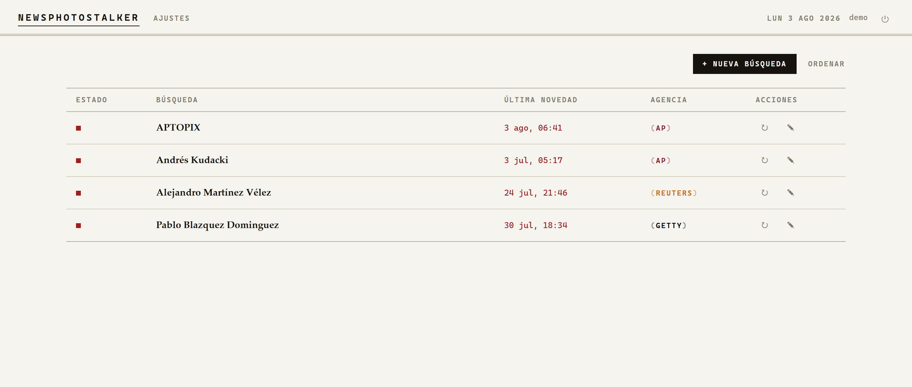
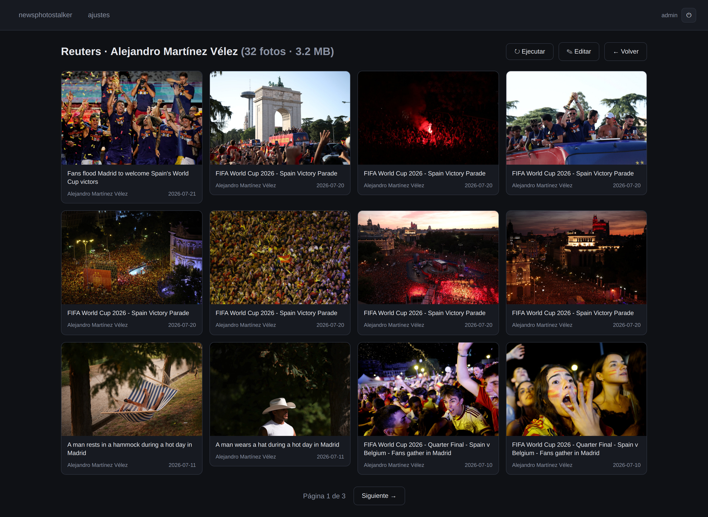
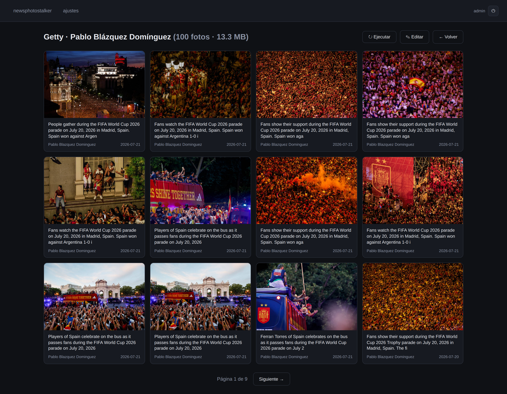

<p align="right"><b>English</b> · <a href="README.es.md">Español</a></p>

<h1 align="center">newsphotostalker</h1>

<p align="center">
  <a href="../../releases"><b>Download</b></a> ·
  <a href="MANUAL.md">Manual (Spanish)</a>
</p>

<p align="center">
  
</p>

---

Watching the work of the photographers at the international press agencies — **AP,
Reuters, AFP, Getty** — has long been one of the traditional ways to study the
craft of photojournalism.

On paper, on dedicated terminals, and on the web since the arrival of the
Internet, many of us have tried to separate the wheat from the chaff: to learn
from the best, and also to study where others fall short.

It has always been a chore to keep a pile of saved searches and to lose time
navigating the agencies' websites, which are not always cleanly designed and
sometimes seem to get worse over time.

**newsphotostalker** makes this as efficient as it gets: a single screen, the same
for all four agencies; searches automated by photographer or keyword; arrange
them, and refresh by hand or on a schedule.

Free for **Windows, Mac and Linux**, under the MIT license.

---

## What it does

You give it a **photographer's name** or a **text query** on any of the four
agencies. It searches on a schedule, downloads whatever is new, and keeps it on
your disk with captions, bylines, credits and dates.

- 🔴 **A flag per search** when new photos arrive, with the date of the latest
  one. It goes out when you open *that* search — not when you glance at the panel.
- ⇅ **Arrange the panel** by hand and group searches with separators.
- ⤓ **Backfill**: pull the archive backwards, as far as your retention allows.
- 🗑️ **Retention** by time (months) or by disk space (MB), purged automatically.
- 🖥️ Runs on **Windows, macOS and Linux**. Nothing to install.

---

## Install

Grab the file for your system from the [releases](../../releases), unzip it, and
run it. Python, the browser driver and everything else travels inside.

| System | What to do |
|---|---|
| **Windows** | Double-click `newsphotostalker.bat`. |
| **macOS** | Double-click `newsphotostalker.command`. macOS blocks it the first time — see below. |
| **Linux** | `./newsphotostalker` — or install it properly with the one-liner below. |

```sh
curl -fsSL https://raw.githubusercontent.com/jaimealekos/newsphotostalker/main/install.sh | sh
```

A terminal window opens (**that window is the program** — closing it stops it)
and the panel opens in your browser. Sign in with **`admin` / `admin`** and
change it in the settings page.

> The panel itself is in Spanish. Wherever this page points you at a button, the
> label you will actually see on screen is quoted after it — settings is
> `ajustes`, and so on.

Your photos, your database and your browser session are created in a **`data/`
folder next to the launcher**. Back that folder up and you have backed up
everything; move it and everything comes along.

> **Do not unzip it into `C:\Program Files`** (or anywhere you cannot write):
> the program needs to create that folder beside itself.

### macOS: the first-run warning

This program is not signed with an Apple developer account, so macOS blocks it
the first time. **It is not broken** — every small downloaded tool gets this.

1. Double-click `newsphotostalker.command`. A warning appears: click **Cancel**
   (not *Move to Trash*).
2. Open **System Settings → Privacy & Security**, scroll to the bottom and click
   **Open Anyway** next to the program's name.
3. Double-click again and confirm **Open**.

> On macOS 15 (Sequoia) and later the old *right-click → Open* trick **no longer
> works**: you have to go through System Settings. If you only get a single
> "Open" button and get nowhere, this is why.

Prefer one command? Open **Terminal**, type `cd ` (with the space), drag the
program's folder in from Finder, press Return, then:

```sh
xattr -dr com.apple.quarantine . && ./newsphotostalker
```

That clears the quarantine flag from the **whole folder**, which is the part
that matters: the program carries a browser and its libraries inside, and a
single still-quarantined piece makes the launch fail without saying anything.

### On a server

```sh
newsphotostalker --host 0.0.0.0 --sin-navegador
```

---

## The agencies

Three of the four need no account at all. Only Reuters does.

| Agency | Account | How it is fetched | Saved at |
|---|---|---|---|
| **AP** | not needed | anonymous search API | 1024 px |
| **Getty** | not needed | server-rendered search pages | 2048 px |
| **AFP** | not needed | same, through Getty's distribution | 2048 px |
| **Reuters** | **yours** | logged-in browser | 640 px |

Those are the largest previews each service hands out without a licence, and
they carry the agency watermark. This tool **finds and tracks** work; licensing
is between you and the agency.

<p align="center">
  <br>
  <em>Reuters — Alejandro Martínez Vélez</em>
</p>

<p align="center">
  <br>
  <em>Getty Images — Pablo Blázquez Domínguez</em>
</p>

### Signing in to Reuters

Reuters Connect requires a session and sits behind an anti-bot wall, so you sign
in **by hand, once**, from settings → sign in to Reuters
(`ajustes → iniciar sesión en Reuters`). A browser window opens, you sign in
there, and the session is kept.

**That is the only window you will ever see.** From then on searches run
headless. Your Reuters password is never written to any file.

It uses a browser you already have — Chrome, Edge, Brave or Chromium. On macOS
and Linux one is bundled, in case you have none.

**No screen on that machine?** Sign in on your laptop, export the session there
(`exportar sesión`) and import it on the server (`importar sesión`), both under
settings. What travels is a small file
with the session already decrypted, so it works across Windows, macOS and Linux.

---

## Under the hood

Python, [FastAPI](https://fastapi.tiangolo.com/), SQLite and
[Playwright](https://playwright.dev/) (Reuters only). No account, no API key and
no telemetry: it talks to the four agencies and to nothing else.

```sh
git clone https://github.com/jaimealekos/newsphotostalker.git
cd newsphotostalker
python -m venv .venv && .venv/bin/pip install -r requirements.txt
cp config.example.yaml config.local.yaml
python run.py
```

Tests: `python -m pytest tests/ -q`.
Packages are built and smoke-tested for the three systems by
[GitHub Actions](.github/workflows/release.yml) on every `v*` tag — nobody
compiles anything, neither you nor whoever downloads it.

The full manual, in Spanish, is in [MANUAL.md](MANUAL.md).

## License

[MIT](LICENSE). Free to use, change and share.

---

<p align="center"><sub>
newsphotostalker is not affiliated with AP, Reuters, AFP or Getty Images.<br>
Photographs belong to their authors and agencies.
</sub></p>
